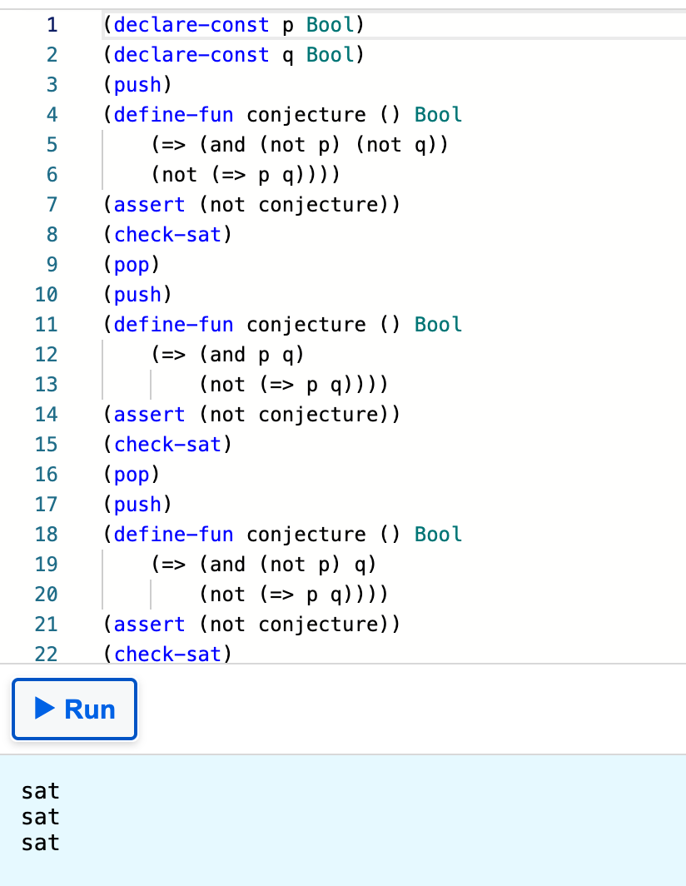

# Exercise Z3

- [x] Follow the [Z3 Playground](https://jfmc.github.io/z3-play/) up to Bitvectors (don't read Bitvectors).

> :warning: Some browsers might not run the playground properly. Safari is a browser we know doesn't work well. Chrome, Chromium, Firefox, and Brave browsers have been tested to work fine.

- [x] Use Z3 to find a solution for the following puzzle:
 

## Solution

Solution: 2

- [x] Write a formula to check if the following two equations are equivalent:
 

## Solution

Solution: equivalent

- [x] A good additional practice will be to try and prove questions in [this file](AdditionalExerciseForSMT.pdf)

## Solution
### Question 1

D) None of the above

### Question 2

C) True for some cases and false for others.

### Question 3

B) False in all cases

### Question 4

A) True in all cases.

### Question 5

C) True for some cases and false for others.

### Question 6

C) True for some cases and false for others.

### Question 7

A) B) C) D)

### Question 8

A) B) C) D)

### Question 9

C) True for some cases and false for others.

### Question 10

A) True in all cases.

> :information_source: You might find the [cheat sheet](Cheat_Sheet.md) useful for the exercises and additional explanations of the Z3 principles.
